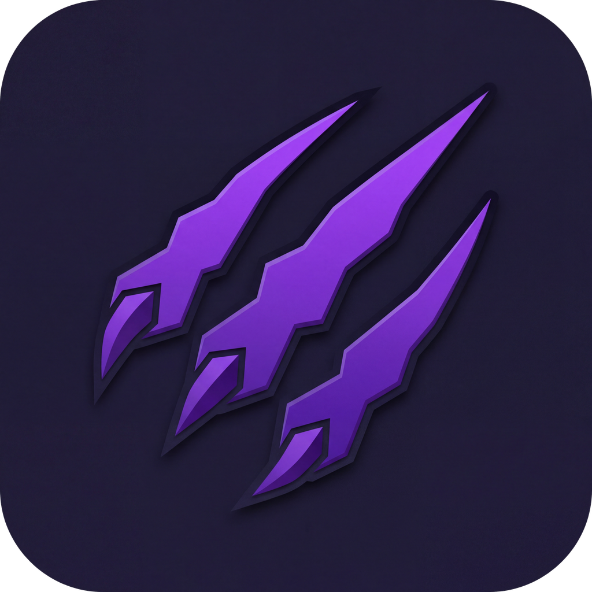

<div align="center">



# Claw Desktop

**OpenClaw 的桌面客户端** — 优雅、流畅、本地优先

[](https://www.electronjs.org/)
[](https://react.dev/)
[](https://www.typescriptlang.org/)
[](https://tailwindcss.com/)
[](LICENSE)

[English](#english) | [中文](#中文)

</div>

---

## 中文

基于 Electron + React + TypeScript 构建的 OpenClaw 网关桌面客户端。深色主题、流式输出、多会话并行，开箱即用。

### ✨ 功能特性

- 🚀 **自动连接** — 启动时自动读取 `~/.openclaw/openclaw.json` 配置，零配置连接网关
- 💬 **多会话并行** — 等待 AI 回复时自由切换会话，后台继续接收消息
- 🔄 **实时流式输出** — Thinking 思考过程、工具调用、Markdown 内容同步展示
- 📎 **图片附件** — 支持截图粘贴、文件拖拽上传图片
- 🌐 **中英双语** — 界面语言自动适配系统设置，随时一键切换
- 🖼️ **图片预览** — 点击图片放大查看，ESC 关闭
- 📋 **复制消息** — 一键复制 AI 回复内容（Markdown / 纯文本）
- 🎨 **深色主题** — 精心调校的暗色 UI，长时间使用不疲劳
- 📌 **系统托盘** — 最小化到托盘，右键快速操作（显示窗口 / 新建会话 / 退出）

### 📦 安装

从 [Releases](https://github.com/ethanfly/claw-desktop/releases) 下载最新安装包，双击安装即可。

### 🛠️ 开发

```bash
# 克隆仓库
git clone https://github.com/ethanfly/claw-desktop.git
cd claw-desktop

# 安装依赖
npm install

# 启动开发模式（热更新）
npm run dev

# 生产构建
npm run build

# 打包安装程序
npm run dist
```

### 📁 项目结构

```
src/
├── main/index.ts              # Electron 主进程
├── preload/index.ts           # Context bridge
└── renderer/
    ├── App.tsx                # 根组件 — 状态管理、WebSocket 事件路由
    ├── lib/
    │   ├── gateway.ts         # OpenClaw 网关 WebSocket 客户端
    │   ├── types.ts           # TypeScript 类型定义
    │   └── i18n.ts            # 国际化（中/英）
    └── components/
        ├── ConnectDialog.tsx   # 网关连接对话框
        ├── Sidebar.tsx         # 会话列表侧边栏
        ├── ChatView.tsx        # 聊天主视图
        ├── MessageBubble.tsx   # 消息气泡（Markdown 渲染）
        ├── InputArea.tsx       # 输入区域（附件、发送）
        ├── ImagePreview.tsx    # 图片全屏预览
        ├── ToolCard.tsx        # 工具调用卡片
        ├── ThinkingBlock.tsx   # 思考过程折叠块
        ├── TitleBar.tsx        # 自定义标题栏
        └── AgentAvatar.tsx     # 动画头像
```

### ⚙️ 配置

首次启动自动检测 OpenClaw 配置文件（`~/.openclaw/openclaw.json`），读取网关地址、端口和认证信息，无需手动填写。

如需手动配置，在连接对话框中填写：

| 配置项 | 说明 | 默认值 |
|--------|------|--------|
| 网关地址 | OpenClaw 网关 URL | `http://127.0.0.1:18789` |
| 认证方式 | Token 或 Password | Token |
| Token / Password | 认证凭据 | 自动读取 |

### 📄 许可

[MIT](LICENSE)

---

## English

A sleek desktop client for [OpenClaw](https://github.com/openclaw/openclaw) gateway, built with Electron + React + TypeScript. Dark-themed, streaming-enabled, multi-session — ready to use out of the box.

### ✨ Features

- 🚀 **Auto-connect** — Reads `~/.openclaw/openclaw.json` on startup, zero-config connection
- 💬 **Parallel sessions** — Switch sessions freely while waiting for AI responses; messages continue in background
- 🔄 **Real-time streaming** — Live thinking process, tool calls, and Markdown content
- 📎 **Image attachments** — Paste screenshots or drag & drop images
- 🌐 **i18n** — Chinese / English interface, auto-detects system language, one-click switch
- 🖼️ **Image preview** — Click to view full-size, ESC to close
- 📋 **Copy messages** — One-click copy AI responses (Markdown / plain text)
- 🎨 **Dark theme** — Carefully crafted dark UI for extended use
- 📌 **System tray** — Minimize to tray, quick actions via right-click menu (Show / New Session / Quit)

### 📦 Installation

Download the latest installer from [Releases](https://github.com/ethanfly/claw-desktop/releases).

### 🛠️ Development

```bash
git clone https://github.com/ethanfly/claw-desktop.git
cd claw-desktop
npm install
npm run dev        # Dev mode with HMR
npm run build      # Production build
npm run dist       # Package installer
```

### ⚙️ Configuration

Auto-detects OpenClaw config at `~/.openclaw/openclaw.json` on first launch. For manual setup:

| Field | Description | Default |
|-------|-------------|---------|
| Gateway URL | OpenClaw gateway URL | `http://127.0.0.1:18789` |
| Auth Mode | Token or Password | Token |
| Token / Password | Credentials | Auto-loaded |

### 📄 License

[MIT](LICENSE)
